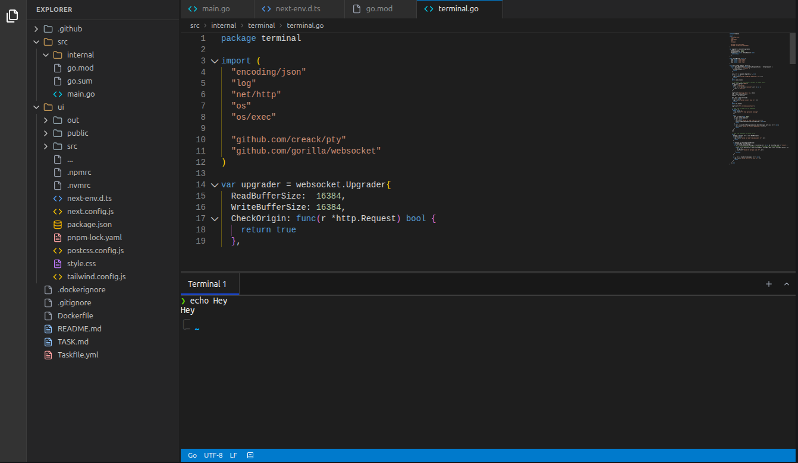

# Lite IDE

A simple tiny web-based IDE built with Go backend and TypeScript/React frontend, packaged as a single binary.



## Features

- **Single Binary**: Complete IDE in one executable
- **Modern UI**: TypeScript, React, Tailwind CSS
- **Monaco Editor**: Full-featured code editor with syntax highlighting
- **File Explorer**: Tree view with folder expansion
- **Tab Management**: Multiple file tabs with dirty state
- **Keyboard Shortcuts**: Ctrl+S to save files
- **Dark Theme**: Modern dark UI theme

## Quick Start

### Prerequisites

- Go 1.22+
- Node.js 18+
- pnpm
- Task (optional, for task runner)

### Build and Run

```bash
# Build the single binary
task build

# Run the IDE
./lite-ide
```

Or use the task runner for development:

```bash
# Development mode (with hot reload)
task ui:dev
task go:dev
```

### Docker

```bash
# Build Docker image
docker build -t lite-ide .

# Run container
docker run -p 3000:3000 lite-ide
```

### Development Commands

```bash
# Install dependencies
cd ui && pnpm install
cd src && go mod tidy

# Development mode
task dev

# Build for production
task build

# Clean build artifacts
rm -f lite-ide
rm -rf ui/out
rm -rf ui/node_modules
```

## API Endpoints

- `GET /api/files` - Get file tree
- `GET /api/files{path}` - Read file content
- `PUT /api/files{path}` - Write file content

## Technologies

- **Backend**: Go 1.22, net/http
- **Frontend**: Next.js 14, React 18, TypeScript
- **Editor**: Monaco Editor
- **Styling**: Tailwind CSS
- **Icons**: Lucide React
- **Package Manager**: pnpm
- **Task Runner**: Task

## License

MIT 