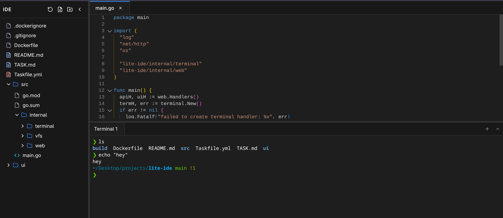

# Lite IDE

A simple tiny web-based IDE built with Go backend and TypeScript/React frontend, packaged as a single binary.



## Features

- **Single Binary**: Complete IDE in one executable
- **Modern UI**: TypeScript, React, Tailwind CSS
- **Monaco Editor**: Full-featured code editor with syntax highlighting
- **File Explorer**: Tree view with folder expansion and real-time updates
- **Tab Management**: Multiple file tabs with dirty state tracking
- **Terminal Integration**: Built-in terminal with WebSocket support
- **Keyboard Shortcuts**: Ctrl+S to save files, Ctrl+` to toggle terminal
- **Dark Theme**: Modern dark UI theme
- **Configurable Panels**: Show/hide editor, terminal, and file explorer
- **Resizable Panels**: Drag to resize file explorer and terminal

## Quick Start

### Prerequisites

- Go 1.22+
- Node.js 18+
- pnpm
- Task (optional, for task runner)

### Build and Run

```bash
# Build the single binary
task build

# Run the IDE
./build/ide
```

Or use the task runner for development:

```bash
# Run the Next.js UI (development mode)
task ui:dev

# Run the built binary (development mode)
task go:dev
```

### Docker

```bash
# Build Docker image
docker build -t lite-ide .

# Run container
docker run -p 3000:3000 lite-ide
```

### Development Commands

```bash
# Install dependencies
cd ui && pnpm install
cd src && go mod tidy

# Development mode
task ui:dev
task go:dev

# Build for production
task build

# Clean build artifacts
rm -f build/ide
rm -rf ui/out
rm -rf ui/node_modules
```

## Available Tasks

- `task ui:dev` - Run the Next.js UI
- `task ui:build` - Build the Next.js UI to static files
- `task go:build` - Build single binary with embedded UI
- `task go:dev` - Run the built binary
- `task build` - Build the project (ui:build + go:build)

## Configuration

The IDE supports configuration via environment variables:

```bash
# API endpoint for backend communication
NEXT_PUBLIC_API_ENDPOINT=http://localhost:3000

# WebSocket host for terminal connections
NEXT_PUBLIC_WS_HOST=ws://localhost:3000

# Panel visibility (set to "false" to hide)
NEXT_PUBLIC_SHOW_EDITOR=true
NEXT_PUBLIC_SHOW_TERMINAL=true
```

### Panel Configuration

- **Editor**: Controls both file explorer and editor visibility
- **Terminal**: Controls terminal panel visibility
- When editor is hidden, terminal takes full height
- File explorer only shows when editor is present

## API Endpoints

- `GET /api/files?root={path}` - Get file tree
- `GET /api/files{path}?root={path}` - Read file content
- `PUT /api/files{path}?root={path}` - Write file content
- `DELETE /api/files{path}?root={path}` - Delete file
- `POST /api/files/rename?root={path}&old={oldPath}&new={newPath}` - Rename file
- `POST /api/files/mkdir?root={path}&path={folderPath}` - Create folder
- `GET /api/watch?root={path}` - Server-sent events for file tree updates

## Technologies

- **Backend**: Go 1.22, net/http, WebSocket
- **Frontend**: Next.js 14, React 18, TypeScript
- **Editor**: Monaco Editor
- **Styling**: Tailwind CSS
- **Icons**: Lucide React
- **Terminal**: xterm.js
- **Package Manager**: pnpm
- **Task Runner**: Task

## License

MIT 